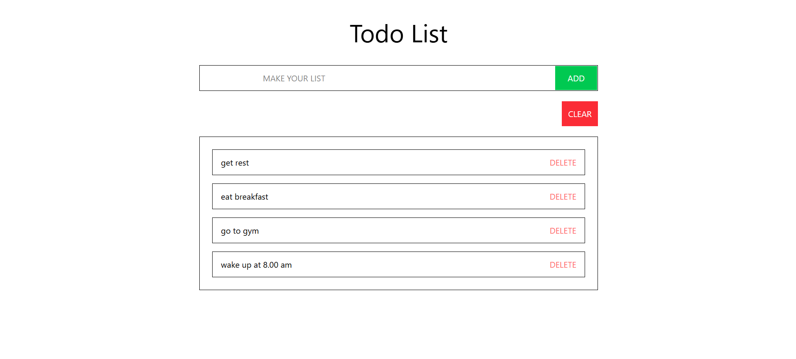

# 📦 Todo-List Project

This project demonstrates JavaScript Todo-List manipulation in a simple and interactive way.

## 📸 Screenshot




## 🔗 Live Demo

👉 [Click here to view the live project](https://dalveli.github.io/TodoList/)

## ⚙️ Tech Stack

- 
- 
- 

## 📁 Run Locally

Clone the project and open `index.html` in your browser.

```bash
git clone https://github.com/dalveli/TodoList.git
